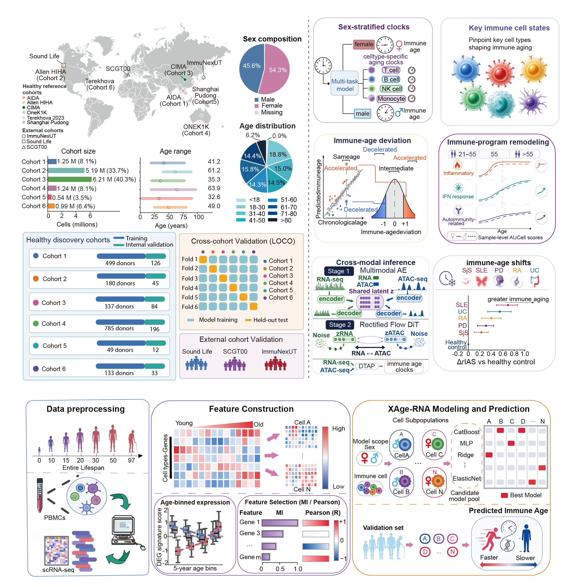

# XAge-Multiomics

### XAge-Multiomics: a framework for cell-state-resolved immune-age estimation using single-cell transcriptomic and chromatin accessibility data from human PBMCs.

In this study, we developed immune aging clocks based on a reference atlas comprising approximately 15.4 million peripheral blood mononuclear cells (PBMCs) from 2,488 healthy donors across six cohorts. By combining cell-state-resolved transcriptomic modeling, multi-omics integration and cross-modal prediction, we investigated immune-age variation across individuals and its cellular correlates in health and disease. Our analyses link immune-age deviation to naïve T cell remodeling, including changes in cell proportions, gene expression and inflammatory transcription.

## Introduction to XAge-Multiomics

We integrated scRNA-seq datasets from six healthy PBMC cohorts: CIMA, Allen HIHA, Terekhova 2023, AIDA, OneK1K and Shanghai Pudong. Using cell-state-resolved gene-expression features, we developed XAge-RNA with CatBoost, including sex-specific and individual cell-state aging clocks.

To incorporate complementary molecular information, XAge-Multiomics combines donor-matched scRNA-seq and scATAC-seq features using ElasticNet. We further developed [scFlowDiff](scFlowDiff/), a conditional flow-matching framework with donor-informed feature prediction, to infer missing clock features and extend multimodal immune-age estimation to samples with only one measured modality.

We evaluated these approaches using held-out donors, cross-cohort analyses and external datasets, and examined associations between immune-age deviation and naïve T cell remodeling in healthy individuals and patients with immune-mediated diseases.

## scFlowDiff code

The [scFlowDiff directory](scFlowDiff/) contains the code for bidirectional RNA–ATAC translation and downstream immune-age prediction. See its [README](scFlowDiff/README.md) for installation and training commands.
