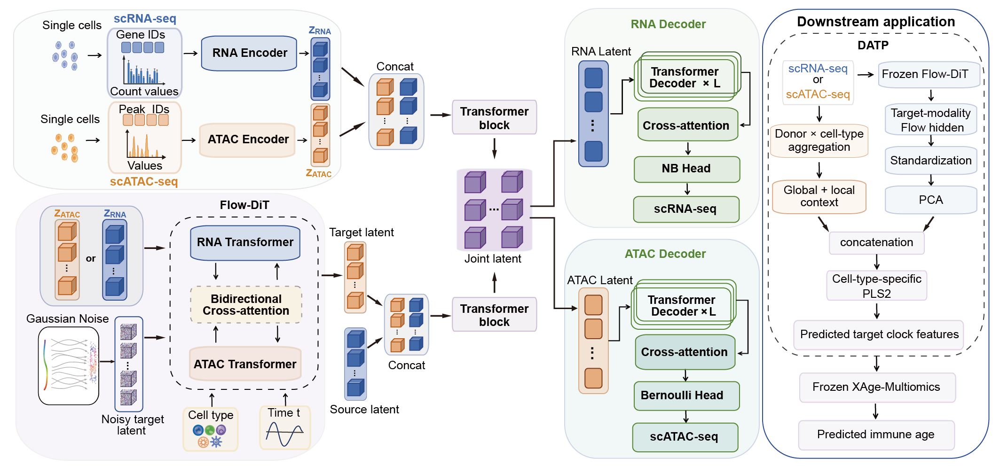

# scFlowDiff

scFlowDiff enables bidirectional translation between single-cell RNA and ATAC
profiles, allowing one modality to be inferred from the other. It supports
RNA→ATAC and ATAC→RNA translation on CIMA and OpenProblem, and downstream
multiomic immune-age prediction for individuals with only RNA or ATAC data.

For immune-age prediction, DATP combines scFlowDiff representations with
observed-modality context to predict the target features required by frozen
XAge-Multiomics clocks. The inferred features and the observed modality are
then used together to predict immune age.



## Install

From the repository root:

```bash
cd scFlowDiff
conda env create -f environment.yml
conda activate scflowdiff
pip install -e ".[train]"
```

## Run

Run the desired experiment from the `scFlowDiff/` directory:

```bash
# CIMA bidirectional translation
CUDA_VISIBLE_DEVICES=0 bash scripts/run_translation_cima.sh

# OpenProblem bidirectional translation
CUDA_VISIBLE_DEVICES=0 bash scripts/run_translation_openproblem.sh

# CIMA immune-age training and evaluation
CUDA_VISIBLE_DEVICES=0 bash scripts/run_immune_age_cima.sh
```

Each command runs training through evaluation. Choose an available GPU with
`CUDA_VISIBLE_DEVICES`. Pretrained immune-age models are in `pretrained/`;
new checkpoints, features, predictions, metrics and logs are written to
`outputs/`.

## Reference server

The server used for these experiments has the following configuration. This
is a reference setup, not a minimum hardware requirement.

| Component | Configuration |
|---|---|
| GPU | 2 × NVIDIA H100 PCIe, 80 GB each |
| CPU | 2 × AMD EPYC 9554, 128 physical cores / 256 threads total |
| System memory | 755 GiB usable RAM |
| Software | Python 3.10, PyTorch 2.5.1, CUDA 12.1 |
